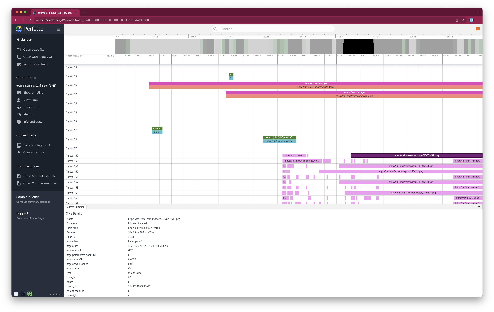
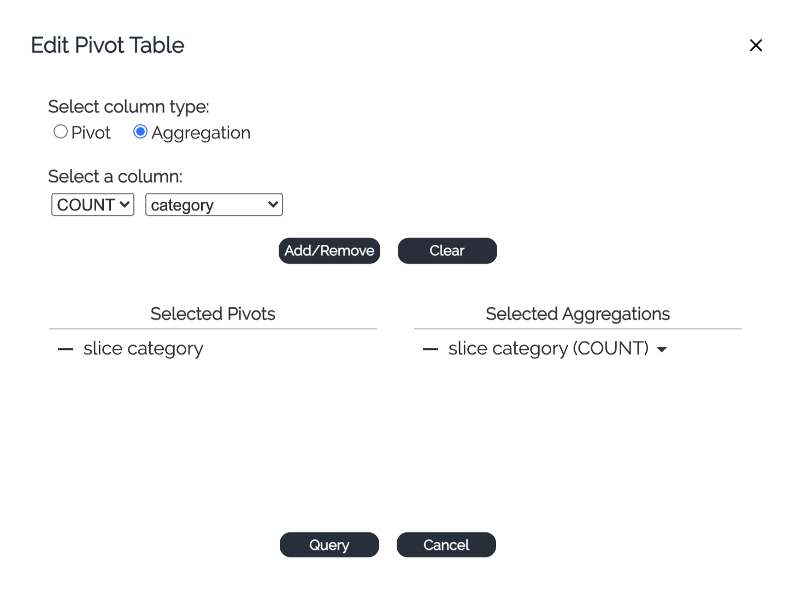
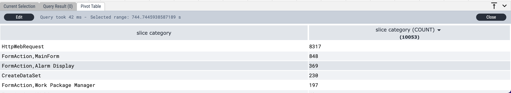

# Cronos
> A set of utilities to logs with time data in it and convert to trace event file format for 


A very nice viewer for the trace event file can be found here https://ui.perfetto.dev/




Format for the time event file can be found here https://docs.google.com/document/d/1CvAClvFfyA5R-PhYUmn5OOQtYMH4h6I0nSsKchNAySU/preview


## Install

The scipt can be found in cronos/convert_time_log.py  it shouldn't have dependencies outside the standard python libraries.


## How to use

Examples of use,

This will generate a trace event file with the name `logs/ADMSClientTiming_07_12_2021.json`
```
python cronos/convert_time_log.py -f logs/ADMSClientTiming_07_12_2021.log
```

To name the output file,
```
python cronos/convert_time_log.py -f logs/ADMSClientTiming_07_12_2021.log -o example.json
```

And to output to stdout
```
python cronos/convert_time_log.py -f logs/ADMSClientTiming_07_12_2021.log -s 
```

Then open and load the generated file into the viewer at https://ui.perfetto.dev/

## Perfetto Queries


When traces are loaded into the perfetto viewer, you can use the  Query(SQL) tool to filter on the trace data.

There seems to be two main tables created at loaded, __slice__ and __args__, there may be more but have not looked at them.

**__slice__** holds the event data and **__args__** holds all the parameters, joint on them using  **arg_set_id**


Note **__dur__** is in nano seconds, divide by 10^9 to get seconds.

### Example Queries

All events matching a specific name,

```
select name, dur/1000000000.0,cat,a.string_value as event_time from slice s,args a where s.arg_set_id = a.arg_set_id  and
name like '/enmac/alarmevent%'
and a.flat_key = 'args.start';
```
|name|dur/1000000000.0|cat|event_time|
|----|----|----|---------|
|/enmac/alarmevent/config|1.978688|CreateDataSet|2021-12-07T17:46:23.902474+00:00|
|/enmac/alarmevent/defaultOwnershipFilter|0.239686|CreateDataSet|2021-12-07T17:46:25.915164+00:00|
|/enmac/alarmevent/alarms|2.348028|CreateDataSet|2021-12-07T17:46:28.903655+00:00|
|/enmac/alarmevent/config|0.672015|CreateDataSet|2021-12-07T17:46:28.903655+00:00|
|/enmac/alarmevent/defaultOwnershipFilter|0.220828|CreateDataSet|2021-12-07T17:46:29.612597+00:00|
|/enmac/alarmevent/config|1.4059788|CreateDataSet|2021-12-07T17:46:29.880425+00:00|
|/enmac/alarmevent/defaultOwnershipFilter|0.2460132|CreateDataSet|2021-12-07T17:46:31.332394+00:00|
|/enmac/alarmevent/config|0.628001|CreateDataSet|2021-12-07T17:46:40.043329+00:00|
|/enmac/alarmevent/defaultOwnershipFilter|0.2149871|CreateDataSet|2021-12-07T17:46:40.711331+00:00|
|/enmac/alarmevent/config|0.30245|CreateDataSet|2021-12-07T17:46:40.980319+00:00|

finding the max or min of a specific event name.
```
select max(dur)/1000000000.0,min(dur)/1000000000.0 from slice where name like '/enmac/alarmevent%';
```
|max(dur)/1000000000.0|min(dur)/1000000000.0|
|----|----|
|2.348028|0.2136729|

Select the thing that takes the longest time

```
select name,dur/1000000000.0,cat,string_value as event_time from slice s,args a 
where dur in (select  max(dur) from slice) and 
s.arg_set_id = a.arg_set_id and 
flat_key ='args.start';
```
|name|dur/1000000000.0|cat|event_time|
|----|----|-----|------|
|/enmac/swex/outages|100.025012|CreateDataSet|2021-12-07T17:54:12.262573+00:00|
|https://trn1nms/enmac/swex/outages|100.025012|HttpWebRequest|2021-12-07T17:54:12.262573+00:00|


select all events where serverCPU is greater than 0.05seconds
```
select distinct name,dur/1000000000.0 as 'duration(s)',category,real_value as serverCPU from 
slice s,args a 
where 
s.arg_set_id = a.arg_set_id and
key = 'args.serverCPU' and real_value > 0.05;
```
|name|duration(s)|category|serverCPU|
|----|----------|--------|--------|
|https://trn1nms/enmac/alarmevent/config|0.999992|HttpWebRequest|0.0703|
|https://trn1nms/enmac/alarmevent/alarms|2.1509|HttpWebRequest|0.0656|
|https://trn1nms/enmac/jobs/jobOperativeDetails|5.602695|HttpWebRequest|0.1953|

## perfectto pivot tables

Enable this feature in the __Support__ section on the LHS under __flags__




results in a pivot table with the following columns




# Developing

The script has been developed with nbdev as the markup/test env. See https://nbdev.fast.ai/tutorial.html for more information.

Contributions are welcome.


# License

Copyright 2021-present Bill Traill 3ideas.co.uk. Released under the terms of the MIT license.

If you're using the library in a commercial enviroment or product, please consider sponsoring its development or paying for maintenace of it. Contact bill@3ideas.co.uk
